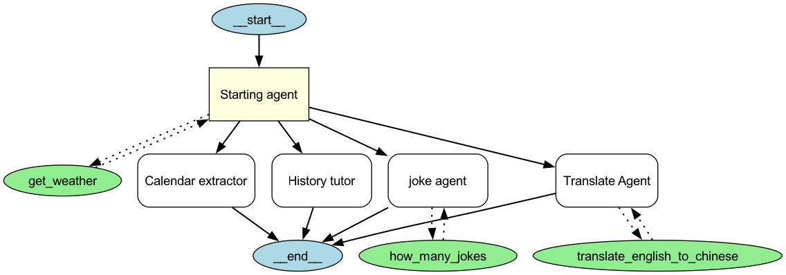

# Multi-Agent System (多 Agent 系统)

分别使用 LangGraph/OpenAI Agents SDK 实现了多个 Multi-Agent System

## Multi-Agent Workflow Patterns

使用 LangGraph 探索了几种常见的 Multi-Agent Workflow Patterns，
包括 Prompt Chaining/Parallelization/Routing/Orchestrator-Worker/Evaluator-Optimizer

[Link](langgraph/workflow_patterns/README.md#workflow-常见模式)

## Multi-Agent System Architectures

使用 LangGraph 分别实现了 Supervisor 和 Network 架构的 Multi-Agent System，
各个 Agent 能够使用 TavilySearch/PythonREPL/CustomTools 等工具协作完成用户任务

### Supervisor

[Link](langgraph/README.md#multi-agent-supervisor)

- 使用 FireWorks 作为模型提供商
- 使用 TavilySearch 网络搜索工具
- 使用 Custom Tools(Add/Multiply/Divide) 执行数学运算

### Network

[Link](langgraph/README.md#multi-agent-network)

- 使用 FireWorks 作为模型提供商
- 使用 TavilySearch 网络搜索工具
- 使用 PythonREPL 执行 Python 代码

## Multi-Agent RAG System

使用 LangGraph 实现了 Multi-Agent RAG System，
能够根据用户问题检索相关文档、重写用户问题以生成高质量回答

[Link](langgraph/README.md#agentic-rag)

## Multi-Agent System based on OpenAI Agents SDK

使用 OpenAI Agents SDK 实现了 Multi-Agent System，
结合 Tool Calling/Guardrail/Structured Output/Handoff/Agent as Tool 等多个特性

- 通过 LiteLLM 接入 Llama/Qwen 等多个模型，支持无缝切换
- 使用 FireWorks 作为模型提供商
- 包括多个专业 Agent，如日程专家、历史专家、笑话专家、翻译专家，
  以及用于处理一般问题的 Starting Agent
- 使用 Input/Output Guardrail，避免解答数学问题、避免回复政治相关，
  控制用户输入和系统回复的安全性。
- 支持 Multi-Tool Calling，包括 Custom Tools（如获取天气/动态生成笑话数量）/Agent as Tool(英汉翻译)
- 支持 Structured Output，自动提取日程信息
