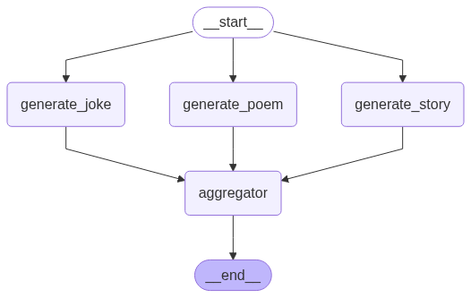
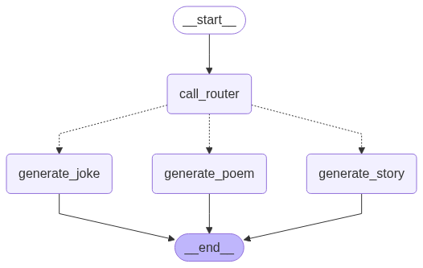
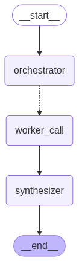
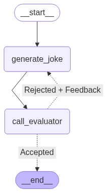

# Workflow 常见模式

## Prompt Chaining

链式结构，在每个节点处可以添加 check 逻辑来确定是否要继续执行后续步骤。

示例：

- Agent 1 生成 joke
- 检查 joke 是否搞笑，如果搞笑就直接输出，不搞笑就需要提升质量
- Agent 2 提升 joke 质量
- Agent 3 再做一些定制化操作，比如给 joke 添加转折。


```python
state = chain.invoke({"topic": "cats"})
print(f"Initial joke: \n{state['joke']}")
if "improved_joke" in state:
    print(f"Improved joke: \n{state['improved_joke']}")
    print(f"final joke: \n{state['final_joke']}")
```

```text
Initial joke: 
Why was the cat sitting on the computer?

Because it wanted to keep an eye on the mouse! 🐱🖱️
```

## Parallelization

并行化，适用于可以把任务拆分成多个独立的小任务的场景，多个独立的小任务并行执行，可以节约整体任务的完成时间。

示例：

- 需要同时生成关于猫的 joke、story、poem
- 在构建图的时候，直接把 START 节点与 3 个 相关的 Agent 相连
- 在执行过程中，3 个 Agent 并行完成自己的任务
- 3 个 Agent 完成自己的任务后，汇聚结果输出给用户



```python
state = parallel_workflow.invoke({"topic": "cats"})
print(f"combined output: \n{state['combined_output']}")
```

```text
combined output: 
joke: 
Why was the cat sitting on the computer?

Because it wanted to keep an eye on the mouse! 🐱💻🐭
story: 
The alley behind Mrs. Gable’s bakery always smelled of warm sugar and damp concrete. On most mornings, it was just a thoroughfare for delivery men and stray thoughts. But on the morning of the Solstice, when the light lay thin and golden, it became a stage for something else entirely.

Seraphina, a tortoiseshell cat with eyes like chips of amber, watched from her perch atop Mrs. Gable’s overflowing window box. Below, the cream-colored Persian, Monsieur Fluffernutter (though no one dared call him that to his face), meticulously cleaned a paw. He disdained the alley’s grit, but tolerated it for the prime basking spot near the sun-warmed brick wall. Perched precariously on a broken chimney pot was Pixel, a tiny, hyperactive tuxedo kitten with ears too large for his head, vibrating with the sheer joy of existing. And huddled in the shadow of a dumpster, half-hidden by a crumpled pizza box, was Scuttle, a scarred tabby with one ear notched and eyes that had seen too many hard winters.

They were, on the surface, a dysfunctional collection of felines. Seraphina considered Fluffernutter insufferably vain; Fluffernutter found Seraphina’s alley-born pragmatism distasteful; Pixel was a whirlwind of attention the others found exhausting; and Scuttle trusted no one, least of all other cats.

But today was different. The Solstice light wasn't just light; it was *aware*. It pooled on the ground, thick as honey, and seemed to hum. And in that light, the usual boundaries dissolved.

Seraphina didn’t *think* Pixel’s flicking tail near the broken bottle was annoying; she *felt* his clumsy, joyful energy, a fizzy stream bubbling right through her. She blinked, a low rumble starting in her chest – not a warning, but a resonance.

Fluffernutter, mid-lick of a hind leg, paused. The usual scent of alley garbage was overlaid, just for a moment, with the soaring, crystalline sweetness of Mrs. Gable’s triple-layer lemon cake. He tilted his head, a profound appreciation for the distant bakery replacing his habitual disdain. He exhaled a soft, purely contented *mrrow*.

Pixel, scrambling towards a discarded feather, suddenly *knew* Scuttle wasn’t sleeping. He felt the deep, scarred currents of Scuttle’s fear and loneliness, old wounds that never quite healed. Instead of pouncing, Pixel froze. Then, with infinite care, he placed the feather gently at the edge of Scuttle’s shadow. *For you*, the intention pulsed silently in the golden air. *It’s soft. Like sun.*

Scuttle, startled, opened one wary eye. He didn’t just *see* the feather; he *felt* the tiny burst of pure, uncomplicated kindness behind the offering, a warmth that momentarily chased the deep chill in his bones. A flicker of something like wonder crossed his face. He didn’t move, but the rigid tension in his shoulders eased, just a fraction.

They didn’t speak. They didn’t need to. The Solstice light was the bridge. It carried the unspoken languages cats always use, but amplified a hundredfold: the flick of an ear holding a universe of emotion, the slow blink of trust, the minute shift in posture revealing inner states. Seraphina understood Fluffernutter’s quiet appreciation of beauty. Fluffernutter sensed Seraphina’s protective watchfulness over the smaller creatures. Pixel felt the ancient resilience in Scuttle. Scuttle felt the vibrant, unbruised hope in Pixel.

They sat, each in their own spot, bathed in the extraordinary light. Seraphina preened a stray piece of leaf from Fluffernutter’s ruff – a gesture of truce, understood instantly. Fluffernutter, instead of bristling, leaned into the touch, a slow purr beginning, deep and resonant. Pixel, emboldened, crept closer to the dumpster and began a complex, silent game of "chase the shaft of light" that made Scuttle’s whiskers twitch with reluctant amusement.

They weren’t friends. They were still Seraphina, the watchful sentinel; Fluffernutter, the fastidious aesthete; Pixel, the endless kitten; Scuttle, the survivor. But for the span of that golden hour, the alley wasn't a battleground or a mere territory. It was a shared space, understood on a level deeper than scent or claw. They were simply *cats*, connected by the fundamental, wordless language of their species, amplified by the Solstice magic – a language of shared sun, shared vigilance, shared moments of absurd joy, and the quiet understanding of knowing another creature who also walks the world on silent paws.

As the sun climbed higher and the light thinned, the connection frayed. Pixel sneezed, shattering the moment. Fluffernutter abruptly stood, fastidiously shaking imaginary dust from his fur, his expression regaining its usual haughty reserve. Seraphina’s gaze snapped back to the alley entrance, scanning for threats. Scuttle pulled the feather closer with a claw, then vanished into the deeper shadows.

Mrs. Gable opened her back door, the warm scent of fresh croissants flooding the alley. The moment was gone. But it lingered. Seraphina caught Fluffernutter’s eye for a fraction of a second longer than necessary, a silent acknowledgment. Pixel, charging past Scuttle’s hiding spot, dropped a tiny, sun-warmed pebble beside the dumpster – a fleeting reminder. And Scuttle, later, when the alley was quiet again, would gently nose the feather, a single, soft purr vibrating in the darkness, a ghost of the golden understanding that had, for a brief, impossible time, woven them all together. They were cats, apart. But they had, for one Solstice morning, truly been a colony.
poem: 
## Ode to the Quiet Sovereigns

They arrive without announcement, silent as moonlight on stone,
Not with fanfare, but a stretch, a low murmur, a yawn.
Soft paws map the contours of cushions and dreams,
Unfurling like smoke from forgotten chimneys.

Observe the architecture: the curve of the spine,
A question mark posed to the dust motes that climb.
Eyes like polished agates, reflecting your face –
Two shifting green galaxies, fathomless, deep in their space.
They hold ancient secrets the daylight obscures,
And judge your whole worth with slow, blinking moors.

They sculpt sunbeams into warm, purring loaves,
Or stalk dust-bunnies fiercely, fulfilling their covenants, their oaths.
A sudden explosion of pounce and of flight!
A phantom mouse conquered in broad, blazing light.
Then, swift as a shadow reabsorbed by the wall,
They feign utter stillness, pretending to sprawl.

They ignore your commands with a dignified air,
Yet demand your attention when *they* need repair
Of chin-scratches, or lap-space, or tuna deemed prime.
Their economy strict, measured out in small chimes
Of purrs – a soft motor that thrums in the chest,
A language of comfort, profoundly expressed
Without words, yet understood deep in the bone:
A contentment complete, utterly, wholly their own.

They leave cryptic markings – a toy on the sill,
A claw on the sofa (a minor ordeal),
A "gift" by the doorstep, delivered with pride,
A mangled reminder they cannot be tamed, only beside.
They are hunters, yet hosts, in a seamless disguise,
With stars in their fur and indifference in their eyes.

So bless the quiet sovereigns, the shadows that creep,
Who guard hearth and heart while the world is asleep.
They need not your worship, your sprawling estates,
Just a sun-warmed spot, and the rhythm of fates
They weave with soft paws on the fabric of night,
Mysterious, graceful, and fiercely polite.
The universe hums in their inscrutable gaze –
We serve them, and call it, quite simply, "amaze."
```

## Routing

路由模式，可以对不同的任务配备不同的专家模型，以提高特定任务的性能。

示例：

- 图本身可以执行多种任务，但是这里只需要一个关于猫的 joke
- router 可以是一个具有 Structured Output 的 LLM，可以把用户需求分类，路由到正确的 Agent
- 特定的 Agent 完成任务后直接结束



```python
state = router_workflow.invoke({"input": "Write a joke about cats"})
print(f"output: \n{state['output']}")
```

```text
output: 
Why was the cat sitting on the computer?

Because it wanted to keep an eye on the mouse! 🐱💻🐭
```

## Orchestrator-Worker

编排器模式，编排节点可以生成完成任务的整体计划，再将拆分后的计划发送给 Worker 节点执行，
最后再合并所有 Worker 节点的结果。比如要生成一篇 report，编排器可以让多个 Worker 节点分别负责不同的段落，
最后再将所有 Worker 节点完成的段落合并起来就是完成的 report。

和并行化的区别是，编排器模式的 Worker 节点数量是动态的，不确定的，由编排器生成的计划决定。
在添加节点时，不需要自行添加多个 Worker 节点。而并行化需要在构建图时就添加好所有相应的并行节点。

示例：

- 需要写一篇某个领域的报告
- 编排器可以生成这篇的报告的大纲，也就是各个段落的 name、description
- 编排器再把每个段落发送给 Worker 节点，由 Worker 节点完成该段落内容的生成
- 所有 Worker 节点完成后，汇聚它们的结果，执行完成



```python
state = orchestrator_worker.invoke(
    input={"topic": "Create a report on LLM scaling laws."}
)
print(f"final_report: \n{state['final_report']}")

```

```text
final_report: 
# Introduction to LLM Scaling Laws

Large Language Model (LLM) scaling laws are empirical relationships that describe how the performance of language models improves predictably as key factors—such as model size (number of parameters), training dataset size, and computational resources—are increased. These laws are typically expressed in mathematical form, showing that metrics like test loss decrease in a log-linear fashion with increases in scale. Pioneering work by Kaplan et al. (2020) established that loss scales as a power law with respect to model size, dataset size, and compute budget, enabling more informed decisions about resource allocation during model development.

The significance of scaling laws lies in their ability to guide the efficient training of LLMs. By understanding these relationships, researchers and engineers can extrapolate model performance based on scale, optimizing trade-offs between model size, data requirements, and computational costs. This predictability has fueled the rapid advancement of models like GPT-3, PaLM, and Llama, where scaling up has consistently resulted in improved capabilities, including better reasoning, few-shot learning, and task generalization.

As models grow larger, performance gains are observed across a range of natural language tasks, such as text generation, translation, and question answering. However, these improvements are not linear; diminishing returns may appear beyond certain thresholds, highlighting the importance of efficient scaling strategies. Ultimately, scaling laws provide a foundational framework for understanding how and why larger models tend to perform better, shaping the trajectory of future LLM research and deployment.# Historical Development

The concept of scaling laws in machine learning, particularly in the context of deep learning and large language models, has evolved significantly over the past decade. Early observations hinted at performance improvements with increased model size, but it wasn't until the late 2010s that systematic investigations began to formalize these trends.

A pivotal moment came in 2020 with the publication of *Scaling Laws for Neural Language Models* by researchers at OpenAI (Kaplan et al.). This study rigorously demonstrated that the performance of transformer-based language models scales predictably with model size, dataset size, and compute budget. The team identified power-law relationships between these variables and test loss, showing that larger models trained on more data consistently achieve better performance, even beyond previous convergence assumptions. This work established a quantitative framework that allows researchers to predict optimal model configurations based on available computational resources.

Prior to this, studies such as those on neural network generalization by Scaling Laws for Transfer (Hestness et al., 2017) had observed similar power-law scaling across diverse domains, including vision and machine translation, laying foundational insights. Their cross-task analysis was one of the first to suggest that scaling patterns might be universal across neural network architectures.

Building on these findings, subsequent research expanded the scope of scaling laws. For instance, work by DeepMind on the Chinchilla model (Hoffmann et al., 2022) challenged OpenAI's earlier recommendations by showing that optimal performance is achieved when model size and training dataset size are scaled in equal proportions—contrary to the earlier emphasis on prioritizing model size. This conclusion prompted a reevaluation of training practices across the industry and highlighted the importance of compute-efficient training.

Other institutions have also contributed critical insights. Studies from Anthropic have explored the predictability of model behaviors, such as reasoning ability and safety-related attributes, as functions of scale (scaling "emergent" abilities). Meanwhile, researchers at Stanford and Google have investigated scaling in multimodal models and sparse architectures, suggesting that scaling laws may generalize beyond dense, autoregressive language models.

Collectively, these milestones reflect a maturing understanding of scaling laws as foundational principles in deep learning. They have not only driven empirical progress in building more capable models but also inspired theoretical efforts to explain why such regularities exist—a pursuit that continues to shape the future of AI research.# Key Scaling Relationships

Empirical studies in large-scale machine learning have revealed predictable scaling laws that govern how model performance improves with increases in model size, dataset size, and computational resources. These relationships help guide efficient training strategies and resource allocation in deep learning.

## Model Size Scaling

Performance, typically measured by validation loss or accuracy, improves as a power law with respect to the number of model parameters \( N \). This relationship is often expressed as:

\[
L(N) = L_0 \left(\frac{N}{N_0}\right)^{-\alpha}
\]

where \( L(N) \) is the loss at parameter count \( N \), \( L_0 \) is the initial loss, \( N_0 \) is a reference parameter count, and \( \alpha \) is the scaling exponent (typically in the range of 0.05–0.2 for language models). Larger models tend to generalize better due to increased capacity for capturing complex patterns, especially in low-data regimes.

## Dataset Size Scaling

Similarly, performance scales with dataset size \( D \) according to:

\[
L(D) = L_0 \left(\frac{D}{D_0}\right)^{-\beta}
\]

with \( \beta \) typically ranging from 0.1 to 0.5. Increasing dataset size reduces overfitting and improves robustness, particularly when model capacity is high. However, returns diminish beyond a certain point if data diversity does not increase proportionally.

## Compute-Optimal Scaling

The most impactful scaling strategy balances model and data size relative to available compute. The Chinchilla scaling law proposes that optimal performance under a fixed compute budget \( C \) (measured in FLOPs) is achieved when:

\[
C \propto N^2 D
\]

suggesting that for a given compute budget, the ideal model and dataset sizes scale such that \( N \propto C^{1/3} \) and \( D \propto C^{1/3} \). This contrasts with earlier practices that over-parameterized models relative to training data, leading to inefficient use of compute.

## Combined Scaling Law

A unified scaling law combining all factors is often expressed as:

\[
L(N, D) = \left(\frac{N_c}{N}\right)^{\alpha} + \left(\frac{D_c}{D}\right)^{\beta} + L_{\infty}
\]

where \( N_c \) and \( D_c \) are scaling constants, and \( L_{\infty} \) is the asymptotic loss. This formulation highlights the diminishing returns from scaling any single dimension independently.

## Implications

Understanding these scaling relationships allows practitioners to:
- Predict performance gains before training large models,
- Allocate budget efficiently across model architecture, data collection, and compute infrastructure,
- Avoid undertraining or overtraining by aligning optimization steps with dataset coverage,

These laws underscore the importance of holistic scaling—simultaneously increasing model size, data volume, and compute—while maintaining empirically derived proportionalities for optimal efficiency.# Implications for Training and Inference

Scaling laws, which describe the predictable relationships between model performance and factors such as model size, dataset size, and computational resources, have profound implications for both the training and inference phases of large language models (LLMs). As models grow larger, performance generally improves in a log-linear fashion with increases in scale, but this improvement comes at substantial costs in terms of computational demand, energy consumption, and monetary expense.

During **training**, the implications are particularly pronounced. According to established scaling laws, reducing test loss by a constant factor requires a proportional increase in model parameters, data, and floating-point operations (FLOPs). This means that achieving marginal gains in performance often necessitates exponentially growing investments in hardware, time, and electricity. For example, training a model like GPT-3 or its successors can cost several million dollars and require thousands of GPU or TPU hours, raising concerns about accessibility and environmental impact. As a result, only well-resourced organizations can realistically undertake such training efforts, potentially concentrating AI development among a small number of entities.

In **inference**, scaling laws affect latency, memory requirements, and operational costs. Larger models demand more memory to store parameters and more compute to generate predictions, which increases response times and limits deployment on edge devices or low-resource environments. While techniques like model compression, distillation, and quantization help mitigate some challenges, they often come at the cost of performance degradation, partially offsetting the benefits of scaling. Moreover, serving large models at scale—for applications like chatbots or translation services—requires extensive infrastructure investments, leading to high operational costs even after training is complete.

Despite these challenges, the predictability offered by scaling laws enables better resource planning and efficiency optimization. Developers can forecast the hardware requirements for desired performance levels and decide whether to scale up, scale out, or explore more efficient architectures. Furthermore, research into **chinchilla-style scaling**—which advocates for longer training on smaller models using more data—suggests that following conventional scaling laws may not always be optimal, opening avenues for more cost-effective training regimes.

In summary, while scaling laws provide a powerful framework for improving model performance, they also amplify the efficiency, cost, and feasibility challenges associated with training and deploying large language models. Balancing these trade-offs will be critical for sustainable progress in AI development, requiring innovations not only in algorithms and hardware but also in access, transparency, and environmental stewardship.# Limitations and Criticisms

Despite the empirical success and predictive power of scaling laws in deep learning—particularly in language models, vision transformers, and other large-scale architectures—several limitations and criticisms have emerged as the field matures. These concerns stem from practical constraints, diminishing returns on performance gains, and broader critiques about the scientific and societal implications of unchecked scaling.

## Practical Constraints

One of the most immediate limitations of continuing to scale models is the sheer computational cost. Training models with billions or trillions of parameters requires massive GPU/TPU clusters, which are energy-intensive and financially prohibitive for most institutions. The environmental impact, driven by high energy consumption and associated carbon emissions, has sparked ethical concerns about the sustainability of ever-larger models.

In addition, data availability poses a hard constraint. Scaling laws assume a sufficient supply of high-quality training data, but the pool of unlabeled, diverse, and non-repetitive text is finite. Attempts to reuse or over-sample data not only violate assumptions of data independence but also degrade model performance due to memorization and reduced generalization.

Memory and inference efficiency are also significant bottlenecks. While larger models may achieve better zero-shot or few-shot performance, deploying them in real-time applications—especially on edge devices—remains impractical due to latency, memory footprint, and cost considerations.

## Diminishing Returns

Empirical evidence increasingly suggests that scaling laws begin to exhibit diminishing returns beyond certain thresholds. For instance, while performance on benchmarks like perplexity or downstream NLP tasks improves predictably with scale up to a point, gains eventually plateau. Some studies indicate that performance improvements per additional parameter or compute unit are decreasing, suggesting that linear or power-law trends observed in mid-scale regimes may not hold indefinitely.

Furthermore, the scaling of metrics such as reasoning ability, factual consistency, and robustness to adversarial inputs does not always align with improvements in capacity or training compute. This misalignment raises questions about what exactly is being learned during scaling—whether models are merely better at pattern matching rather than developing deeper understanding.

## Critiques from the Research Community

Several researchers have critiqued the overreliance on scaling as a primary driver of progress in AI. Prominent voices argue that scaling alone is not a substitute for architectural innovation, better learning algorithms, or grounded representations. For example, models like Chomsky and Bender have warned that scaling statistical patterns without semantic understanding may lead to systems that are fluent but lack coherence, truthfulness, or responsibility.

There is also concern that scaling laws encourage a "bigger is better" mindset, which centralizes AI development in well-resourced tech companies and diverts attention from fundamental research into interpretability, alignment, robustness, and fairness. Critics argue that this concentration of power exacerbates inequities in AI research and limits scientific diversity.

Moreover, some challenge the theoretical foundations of scaling laws themselves. Recent work suggests that observed power-law behaviors may be artifacts of limited data ranges or specific experimental setups, and thus not fundamental laws akin to physical principles. The extrapolation of these trends to future models—sometimes used to predict human-level AI timelines—is viewed by many as speculative and potentially misleading.

In sum, while scaling laws have provided valuable empirical guidance, their limitations underscore the need for complementary advances in efficiency, algorithmic design, and ethical considerations to ensure sustainable and meaningful progress in artificial intelligence.# Future Directions

As traditional scaling approaches, such as increasing transistor density under Moore’s Law, encounter physical and economic limitations, researchers and industry leaders are actively exploring alternative pathways to sustain performance improvements in computing systems. A key area of investigation is the development of novel scaling paradigms beyond CMOS technology, including quantum computing, neuromorphic computing, and spintronics. These emerging technologies leverage fundamentally different physical principles to process information, potentially offering exponential performance gains for specific problem domains.

Another promising direction is the shift toward specialized architectures tailored to specific workloads, such as AI accelerators, tensor processing units (TPUs), and domain-specific integrated circuits (DSICs). These architectures eschew the generality of conventional CPUs in favor of maximizing efficiency for targeted applications, significantly reducing power consumption and latency. Furthermore, advances in heterogeneous computing—integrating multiple types of processing elements (e.g., CPUs, GPUs, FPGAs) on a single chip or within tightly coupled systems—enable dynamic workload allocation to the most appropriate hardware unit, optimizing both performance and energy use.

Beyond hardware, software-hardware co-design is emerging as a critical enabler of efficiency. By jointly designing algorithms and hardware to exploit sparsity, approximate computing, and adaptive precision, systems can minimize redundant computations and data movement. Techniques such as in-memory computing and near-data processing also aim to overcome the von Neumann bottleneck by reducing reliance on data transfer between memory and processing units.

Additionally, new packaging technologies, such as 3D stacking and chiplets, are extending the life of scaling by enabling higher integration density and improved interconnect bandwidth without requiring a reduction in feature size. These system-level innovations, combined with advances in materials science—such as the use of 2D materials like graphene and transition metal dichalcogenides—open new frontiers for developing ultra-low-power, high-performance computing platforms.

Collectively, these future directions signal a shift from reliance on traditional scaling toward a more holistic, multidisciplinary approach to compute efficiency—one that integrates breakthroughs in physics, architecture, design methodology, and fabrication to sustain the trajectory of technological progress.## Conclusion

Scaling laws have emerged as a foundational principle in the development of large language models (LLMs), providing a predictable framework that links model performance to scale—specifically, model size, dataset size, and computational resources. These empirical relationships have enabled researchers to forecast improvements in capabilities, guiding investment in infrastructure and model design with remarkable accuracy. As a result, scaling laws have directly influenced the rapid advancement of LLMs, driving the creation of increasingly capable systems that push the boundaries of what AI can achieve in language understanding, generation, and reasoning.

Beyond technical progress, scaling laws have reshaped the landscape of AI research and industry. They have shifted emphasis toward large-scale training and data-centric approaches, influencing decisions on resource allocation, model deployment, and ethical considerations such as environmental impact and accessibility. Moreover, the success of scaling laws has sparked renewed interest in identifying similar principles across other domains of AI, from multimodal learning to reinforcement learning, suggesting a broader paradigm where systematic scaling can unlock emergent behaviors and generalization.

In sum, scaling laws are not merely descriptive tools but active catalysts in the evolution of AI. Their predictive power continues to shape the strategic direction of both academic and industrial efforts, underscoring their critical role in advancing the field while prompting deeper inquiry into the limits and alternatives of scale-driven progress.
```

## Evaluator-Optimizer

生成器-优化器，一个 Agent 负责生成，一个 Agent 负责评估并生成评估结果。
根据评估结果，可以直接结束或者将控制权转移到生成器，生成器根据评估结果重新生成。

示例：

- 生成器 Agent 负责生成 joke
- 评估器 Agent 负责评估 joke 是否搞笑，并给出评估结果 feedback
- 如果足够搞笑，就结束；否则将控制权转移到生成器 Agent，生成器 Agent 结合评估结果 feedback 重新生成 joke



```python
state = optimizer_workflow.invoke({"topic": "Cats"})
print(f"joke: \n{state['joke']}")
```

```text
joke: 
Why was the cat sitting on the laptop?

Because it wanted to keep an eye on the mouse! 🐱💻🖱️
```
